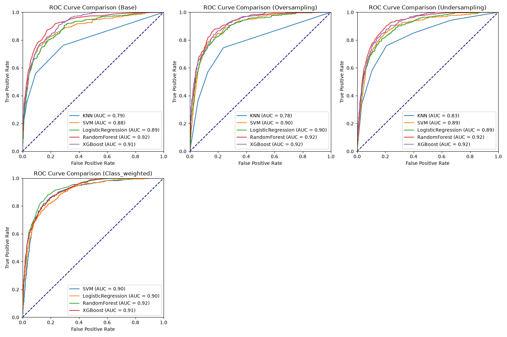
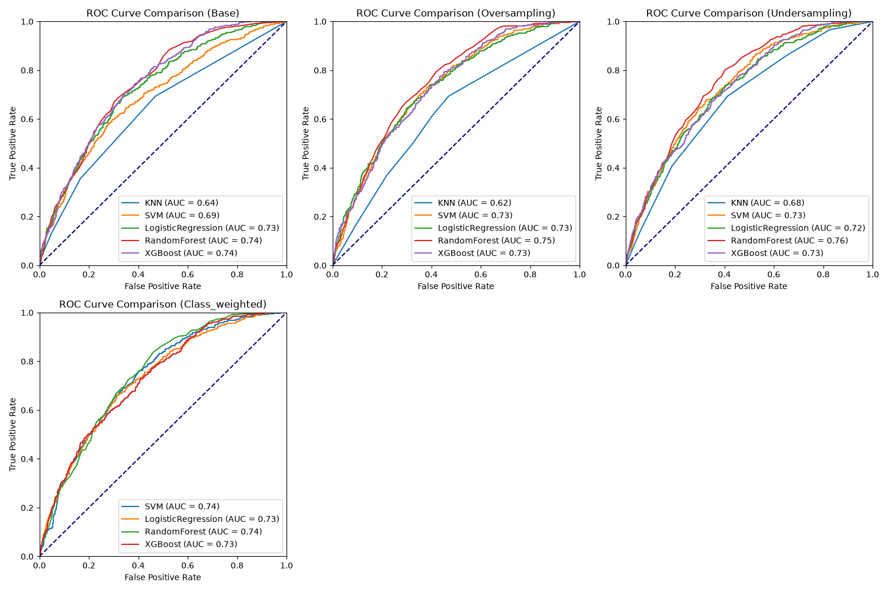
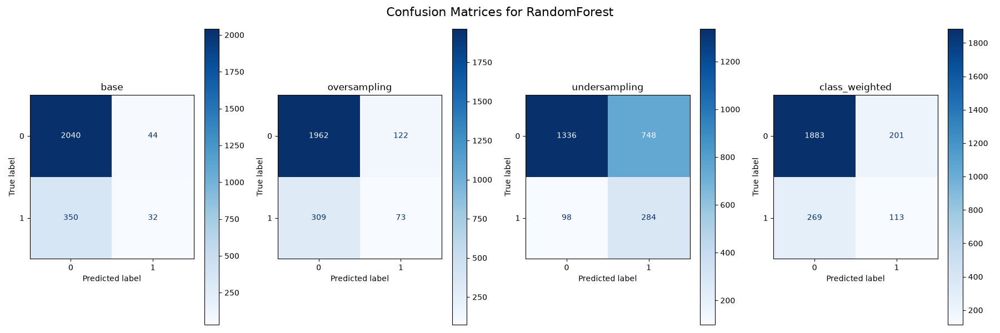

# E-Commerce Purchasing Intention (Session Level Prediction & Analysis)

An end-to-end case study in predicting purchase intent from raw e-commerce clickstream data from the [UCI Online Shoppers Purchasing Intention dataset](https://archive.ics.uci.edu/dataset/468/online+shoppers+purchasing+intention+dataset) (2018), to a modelling pipeline, a local dashboard, and an analysis report.

> **Published Report** — *link to be added once GitHub Pages is live.* \
> **Model Documentation & validation report** - *link to be added.* \
> **Exploratory Data Analysis** - *[`notebooks/analysis.ipynb`](/notebooks/analysis.ipynb)*


## Overview
In this dataset, **84.5%** of e-commerce sessions end without a purchase, and there is no way to differentiate a recoverable session from a lost one while a visitor is still on the site. This case study turns a year of session telemetry **(12,330 sessions, with 15.47% converted)** into a purchase-probability score that can be acted on mid-session, evaluated across **76 model configurations** (5 classifiers × 4 class-imbalance regimes × 2 feature sets × 2 feature-provenance arms, minus weighted KNN that **scikit-learn** has no mechanism for), with a model pipeline and operating points chosen by threshold sweep.

Two explicit findings:

1. **One feature carrying most of the apparent performance**: and will be excluded in session level production (see *Feature Decision* below).
2. **Where the decision cut-off sits matters more than which algorithm draws it.** (see *Arm Comparison* below).


## Results

The model outputs a **probability** between 0 and 1 for each session (rather than "buy" or "not buy"). A **threshold** is the cut-off chosen to flag every session scoring above it. Moving that cut-off is a business decision, and the measures below describe what you get at any given choice:

| Metric | Description | Context |
|-|-|-|
| **Recall** | Of all the sessions that *would* have converted into a purchase, what share did we flag? | Higher = fewer buyers missed.|
| **Precision** | Of the sessions we flagged, what share actually converted? | Higher = less budget wasted on non-buyers.|
| **Lift** | How much better than guessing. | **2× means the flagged group buys at twice the rate of a random group.**|
| **AUC** | How well the model *ranks* sessions from least to most likely to buy, independent of any cut-off. | 0.5 is a coin flip; 1.0 is perfect. |
| **F1** | A single score balancing precision and recall. | "F1 @ 0.5" means *F1 measured at the 0.5 cut-off* — useful only for comparing like with like. |

Precision and recall pull against each other; flag more sessions and you catch more buyers but waste more incentives. That trade is the operating point, and it is set by the threshold.

### The headline — session telemetry only (64 features, session-bound production model)

Random Forest, selected across the full 19-configuration grid and thresholded:

| Accuracy | Precision | Recall | F1 | **AUC** |
|-|-|-|-|-|
| 0.657 | 0.275 | 0.744 | 0.402 | **0.756** |

**Good for better targeting, not guarantees...** 

Against a base rate where 15.5 in 100 sessions convert:

| Cut-off | Precision | Lift vs. random | Recall | Sessions flagged (of 2,466) |
|-|-|-|-|-|
| 0.40 | 0.238 | 1.54× | 0.880 | 1,410 |
| **0.45** | 0.254 | 1.64× | **0.827** | 1,246 (published high-reach point) |
| 0.50 | 0.272 | 1.76× | 0.762 | 1,069 |
| **0.60** | 0.311 | **2.01×** | 0.568 | 698 (published high-precision point)|

The 0.60 row can be read/understood as:
>*Flag the **698** highest scoring sessions and about **31.1 in 100** of them will buy, roughly doubles (**2.01×**) the **15.5 in 100** you would get by flagging at random, while catching **56.8%** of all buyers there were*

The highest precision this model reaches at *any* cut-off is 0.476, and only by flagging 5% of buyers (a *discount-code* use case is not supportable on this data).

### The ceiling, for reference — with `PageValues` retained (65 features)

| Accuracy | Precision | Recall | F1 | **AUC** |
|---|---|---|---|---|
| 0.898 | 0.740 | 0.529 | 0.617 | **0.918** |

This model scores far better but has been decided that it **cannot be deployed** in the scope of this use case (see below). Removing `PageValues` costs a mean **0.297 of F1 across all 19 configurations**, and not one configuration improves without it. That gap is the measurement that exists to conform to the **session-bound** caveat.

### Feature Decision

`PageValues`, the strongest predictor in the dataset, is derived from **completed transactions**. The dataset defines it as value accruing to a page from "the completion of an eCommerce [transaction]".

Two reasons for this exclusion:

- **It partly encodes the answer.** Among sessions with identical browsing behaviour (1–5 product pages viewed), 2.4% convert when `PageValues` is zero and **85.4%** convert when it is positive. Evaluating this feature as an engagement signal, the effect is strongest for the *least* engaged sessions, with the value credited backwards from a purchase rather than forwards from session clickstream behaviour.
- **It cannot be computed for a session in progress.** It is a page-level average over a reporting window, so the number the model trained on simply does not exist yet at the moment you would want to score a session.

In other words, this singular feature is extremely correlated to the resulting purchasing conversion and is flagged as an anomaly when predicting user behaviour mid-session. It can be interpreted as:
>*`PageValues` is a partial record of the outcome rather than the observation of the session*

This project, thus, runs **two arms** and publishes both:

| Arm | N_Features | Role |
|-|-|-|
| **Telemetry** | 64 | **The production model** (only signals that can be observed mid-session) |
| **Ceiling** | 65 | Includes `PageValues` as a measured upper bound analysis |

Keeping the ceiling is deliberate in the analysis. The gap between AUC 0.756 and 0.918 is what quantifies the cost of excluding and treating the feature as an outlier. 

### Arm Comparison
_**Ceiling**_


_**Telemetry**_


Same axes, same models.
>Again, native *scikit-learn* **KNN** does not support `class-weight`, hence, it is voided (for now, may be revisited later for analysis)

**Why the choice of imbalance strategy stopped mattering?**

Only ~15% of sessions convert, so the initial instinct to deal with this highly imbalanced data is by "rebalancing". Comparing those strategies at the default 0.5 cut-off, then again at each one's own best cut-off (Random Forest, full feature set):

| | base | class-weighted | oversampling | undersampling | spread |
|-|-|-|-|-|-|
| **Ceiling** — F1 @ 0.5 | 0.629 | 0.651 | 0.668 | 0.620 | 0.049 |
| **Ceiling** — best F1 | **0.671** | 0.661 | 0.668 | 0.663 | **0.009** |
| **Telemetry** — F1 @ 0.5 | 0.143 | 0.327 | 0.273 | 0.401 | 0.258 |
| **Telemetry** — best F1 | 0.404 | 0.397 | **0.409** | 0.407 | **0.011** |

At a fixed cut-off the strategies look 2.8 times apart on the telemetry arm. Give each its own cut-off and they land within **0.011 F1** of one another. The comparison measurement has shifted from which strategy *learns* better to which one scored an arbitrary 0.5.

Models are therefore selected by **AUC** (ranking quality) and the operating point is set separately by threshold. Where two configurations rank within 0.005 AUC of each other, the simpler one wins.
>Refer to: [`data/regime_threshold_comparison.csv`](data/regime_threshold_comparison.csv), 76 rows


This is observed when comparing the confusion matrices of the different sampling strategies


| Strategy | Missed buyers (FN) | False alarms (FP) | Buyers caught (TP) | Sessions flagged (TP+FP) |
|-|-|-|-|-|
| base (no rebalancing) | 350 | **44** | 32 | 76 |
| oversampling | 309 | 122 | 73 | 195 |
| undersampling | **98** | 748 | 284 | 1,032 |
| class-weighted | 269 | 201 | 113 | 314 |

> ***missed buyers** (someone who would have converted, never flagged) and **false alarms** (someone flagged who was never going to buy)*

No panel is explicitly better than the others:
- left untouched it flags 76 sessions and catches 32 of the 382 buyers
- undersampled it flags 1,032 and catches 284, resulting in 748 wasted flags for the difference

Every one of these positions is reachable from a *single* model by moving the cut-off, so the visible gap between panels is a gap in where each strategy happened to leave the 0.5 cut-off line (not what any of the models learned), hence, rather than choosing the rebalancing strategy, the business decision is to choose the cut-off.


## Quickstart
### macOS dependency for `xgboost`
```bash
brew install libomp
```
On Linux the equivalent is `libgomp1`.

### Setup workspace with `uv`
```bash
uv sync
```

```bash
uv run pi-pipeline
```

Fetches and caches the dataset, then runs **both arms** (four 19-configuration grids, tuning, four threshold sweeps, the `PageValues` ablation, the regime comparison and the SMOTE check), writing every CSV, figure and model bundle. (**~5 minutes**)


## Repository structure

| Path | Contents |
|-|-|
| `src/purchasing_intent/` | The package: `config` (every constant), `data`, `features`, `pipeline`, `models`, `evaluate`, `thresholds`, `tuning`, `persistence`, `comparison`, `plots_mpl`, `cli` |
| `notebooks/analysis.ipynb` | Narrated analysis (reasoning behind every step of the pipeline) |
| `data/` | 15 CSVs: `raw.csv`, results and threshold sweeps for both arms (`*_no_pagevalues*` is telemetry-only), `regime_threshold_comparison.csv`, `smote_check.csv`; `baseline/` holds pre-remediation results kept as delta reference; `cache/` pins source dataset so a fresh clone runs offline |
| `img/` | 31 figures, all regenerated from one pipeline run |
| `models/` | Four model bundles — **not published**, see below |
| `docs/` | Model documentation report — *not published yet* |

### Two Tier Bundles

`models/` is **excluded from the repository** due to:
- rebuilt via `uv run pi-pipeline` (~5 min)
- files are not byte-stable
- CI rebuilds them from the source on every push (probable drift)

Once built, four bundles exist:

| Bundle | Tier | N_Features | Role |
|-|-|-|-|
| `models/production_full.joblib` | **production** | 64 | **The deployable model.** Every scoring claim and actionable operating point |
| `models/production_top10.joblib` | production | 64 | Top-10 feature candidate |
| `models/ceiling_full.joblib` | analysis-ceiling | 65 | The measured ceiling |
| `models/ceiling_top10.joblib` | analysis-ceiling | 65 | Top-10 feature candidate (ceiling) |

Each carries its fitted pipeline, ordered feature list, expected dtypes, its operating points (with measured precision, recall and lift), and testing to prove it reproduces the model it was trained on. Every bundle declares its tier and arm, and the ceiling bundles carry a `not_deployable_reason` since a 64-column session cannot be silently scored through a 65-column model.


## Data Provenance

**UCI Online Shoppers Purchasing Intention Dataset**, ID 468 (DOI [10.24432/C5F88Q](https://doi.org/10.24432/C5F88Q))

| Property | Value |
|---|---|
| Instances | 12,330 sessions, one per distinct user over a one-year window |
| Vintage | **2018** |
| Raw features | 17 (10 numerical, 8 categorical); 65 after one-hot encoding |
| Target | `Revenue` (boolean) |
| Class balance | 1,908 positive (15.47%) / 10,422 negative (84.53%) |
| Missing values | None |
| Split | 9,864 train / 2,466 test, stratified |

Sakar, C. O., Polat, S., Katircioglu, M., & Kastro, Y. (2019). *Real-time prediction of online shoppers' purchasing intention using multilayer perceptron and LSTM recurrent neural networks.* Neural Computing & Applications. DOI [10.1007/s00521-018-3523-0](https://doi.org/10.1007/s00521-018-3523-0)


## Limitations

- **`PageValues` is outcome-derived and excluded from the headline**, for the two reasons given under *Feature Decision*. `BounceRates` and `ExitRates` were audited against the same standard and are traffic-derived, not transaction-derived.
- **The data is from 2018.** Since then, there have been major shifts in session-bound features, such as mobile commerce, instant checkouts, and privacy driven processes. Hence, this is **methodology validation, not an accurate representation of current-day forecast**.
- **The production model's precision is not guaranteed.** Its maximum precision cut-off is 0.476, reached at 5% recall. Its operating points are, thus, expressed as *lift over the base rate*, not as a precision floor.
- **Not yet calibrated.** The production model trains on a rebalanced sample, so its raw scores are influenced by a ~50/50 class prior it will never meet in production. Ranking and lift are unaffected, but interpretation raw scores as a likelihood is currently **optimistic**. Since the operating points chosen uses the same data they are scored on, performance metrics may have some optimistic bias (negligible 0.0001), but there would still be some uncertainty (margin of error).
- **Single-seed point estimate.** `random_state=42` throughout; run-to-run variance is uncharacterized, so differences of a few thousandths of F1 are not meaningful.
- **Sessions are independent here by construction, but not in production.** The dataset is deliberately one session per user; real traffic contains returning visitors whose sessions correlate.
- **Strictly an analysis modelling pipeline.** There is no causal claim, no live data integration, no serving API, no monitoring, no A/B tests, all of which remains out of scope.

